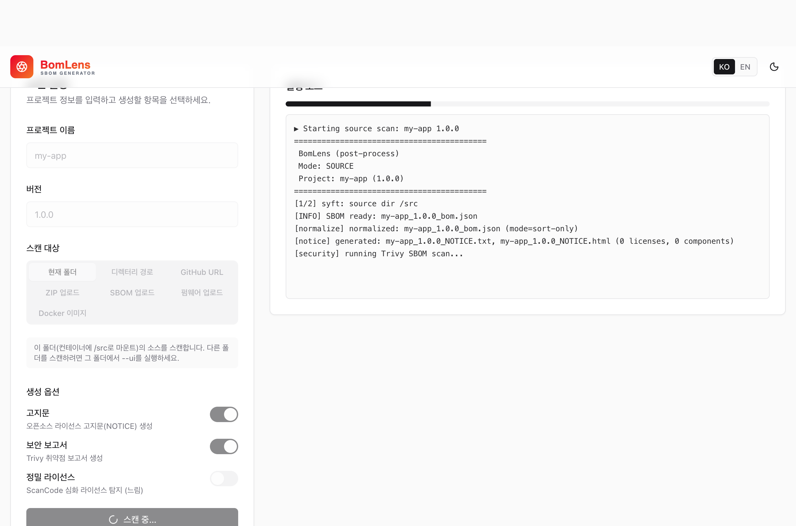

## BomLens

BomLens는 공급사가 Docker 환경에서 SK텔레콤 정책에 맞는 산출물을 생성할 수 있는 오픈소스 도구입니다. 로컬에 언어별 도구를 따로 설치하지 않아도 여러 언어를 분석해 CycloneDX(JSON) 산출물을 만듭니다.

이 페이지는 빠른 시작만 다룹니다. 설치, 전체 옵션, 언어별 가이드, 입력 시나리오, 웹 UI 등 자세한 내용은 공식 저장소 문서를 참고하세요.

> [github.com/sktelecom/sbom-tools](https://github.com/sktelecom/sbom-tools)
>
> 버그 제보, 기능 제안, Pull Request 기여를 환영합니다.

## 생성되는 산출물

한 번의 실행으로 다음 세 가지가 함께 생성됩니다(`--all` 옵션).

| 산출물 | 파일 | 용도 |
|--------|------|------|
| SBOM | `{프로젝트}_{버전}_bom.json` | CycloneDX 1.6 구성요소 명세 (납품 기준 산출물) |
| 오픈소스 고지문 | `{프로젝트}_{버전}_NOTICE.{txt,html}` | 라이선스 의무 이행을 위한 고지문 |
| 오픈소스위험분석보고서 | `{프로젝트}_{버전}_risk-report.{md,html}` | 라이선스와 취약점 위험 집계 |

## 사전 준비

BomLens는 Docker 위에서 동작합니다. Docker 엔진 20.10 이상을 설치하고 실행해 두세요. Docker가 없는 Windows에서는 무료인 Rancher Desktop을 권장합니다. 첫 실행 때 스캐너 이미지(약 3–4GB)를 내려받느라 5–15분쯤 걸립니다.

## Windows에서 명령줄 없이 시작

명령줄이 익숙하지 않다면 두 가지 방법 중 하나로 SBOM을 생성할 수 있습니다. 자세한 절차는 [명령줄 없이 시작하기](https://sktelecom.github.io/sbom-tools/ko/start/no-cli/)를 참고하세요.

- 실행 파일: [최신 릴리스](https://github.com/sktelecom/sbom-tools/releases/latest)에서 `SBOM-Generator-*.exe`를 내려받아 더블클릭합니다. 이 파일은 아직 코드 서명이 되어 있지 않아 Windows SmartScreen 경고가 나타나면 "추가 정보"를 누른 뒤 "실행"을 선택합니다.
- 저장소 ZIP: 저장소의 `Code` 버튼에서 `Download ZIP`을 받아 압축을 풀고 `scripts\sbom-ui.bat`를 더블클릭하면 브라우저에서 `http://localhost:8080`이 열립니다.

웹 UI에서는 오른쪽에 진행 로그가 실시간으로 표시되고, 완료되면 산출물을 내려받을 수 있습니다.



## 빠른 시작 (CLI)

macOS와 Linux에서는 셸에서 스크립트를 내려받아 실행합니다.

```bash
curl -O https://raw.githubusercontent.com/sktelecom/sbom-tools/main/scripts/scan-sbom.sh
chmod +x scan-sbom.sh
cd /path/to/my-project
/path/to/scan-sbom.sh --project "MyApp" --version "1.0.0" --all --generate-only
```

- `--generate-only`는 포털 업로드 없이 로컬에 파일만 생성합니다(제출 전까지 권장).
- 웹 UI로 쓰려면 `./scan-sbom.sh --ui`를 실행합니다(브라우저에서 `http://localhost:8080`).
- Windows에서 명령줄을 쓸 때는 같은 명령을 `scripts\scan-sbom.bat`로 실행합니다(Git Bash를 거치므로 Git for Windows 필요).
- GitHub URL, 소스 ZIP, Docker 이미지, 펌웨어, 바이너리 등 다른 입력 형태와 전체 옵션은 [CLI 레퍼런스](https://sktelecom.github.io/sbom-tools/ko/reference/cli/)를 참고하세요.

## 더 알아보기

도구 사용법의 정본은 저장소 문서입니다.

| 주제 | 문서 |
|------|------|
| 설치, 첫 SBOM, 웹 UI | [시작하기](https://sktelecom.github.io/sbom-tools/ko/start/first-scan/) |
| 전체 옵션, 언어별, CI/CD | [CLI 레퍼런스](https://sktelecom.github.io/sbom-tools/ko/reference/cli/) |
| 입력 형태별 시나리오 | [입력 시나리오](https://sktelecom.github.io/sbom-tools/ko/guides/by-input/) |
| 고지문·보안 보고서 | [리포트 가이드](https://sktelecom.github.io/sbom-tools/ko/guides/reports/) |

## 다음 단계

SBOM을 생성한 뒤 [검증 체크리스트](../checklist/)로 파일을 확인하고 [제출 절차](../submission/)에 따라 제출합니다. 필수 데이터 필드는 [제출 요구사항](../requirements/), SKT 도구 대신 cdxgen, Syft 등을 직접 쓰는 방법은 [오픈소스 도구 활용](../creation-guide/)을 참고하세요.
