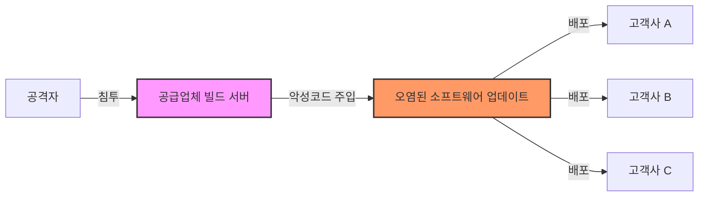

## 1. 소프트웨어 공급망 공격이란?

소프트웨어 공급망 공격(Software Supply Chain Attack)은 공격자가 소프트웨어 개발사나 공급업체의 시스템, 또는 개발 과정에 침투하여 악성 코드를 심거나 취약점을 악용하는 사이버 공격 기법입니다.

전통적인 공격이 최종 사용자를 직접 겨냥했다면, 공급망 공격은 신뢰받는 소프트웨어 업데이트나 개발 도구를 오염시켜 이를 사용하는 수많은 하류(Downstream) 기업과 사용자들을 동시에 감염시킵니다.

## 2. 주요 공격 사례

최근 몇 년간 발생한 대형 보안 사고들은 공급망 보안의 중요성을 전 세계에 각인시켰습니다.

### SolarWinds 사태 (2020)
- 개요: 네트워크 모니터링 솔루션인 SolarWinds Orion의 빌드 시스템이 해킹당해, 정상적인 업데이트 파일에 백도어가 심어졌습니다.
- 피해: 미국 정부 기관, 포춘 500대 기업 등 전 세계 18,000여 개 조직이 피해를 입었습니다.
- 시사점: 신뢰하는 벤더의 정식 서명된 소프트웨어조차 안전하지 않을 수 있음을 보여주었습니다.

### Log4j 취약점 (2021)
- 개요: 자바 기반 로깅 라이브러리인 Log4j에서 원격 코드 실행(RCE)이 가능한 치명적인 취약점(Log4Shell)이 발견되었습니다.
- 피해: 이 라이브러리를 직간접적으로 사용하는 전 세계 수억 대의 디바이스와 서버가 위험에 노출되었습니다.
- 시사점: SBOM(Software Bill of Materials)을 통해 우리 시스템이 어떤 오픈소스를 사용하고 있는지 파악하는 것이 얼마나 중요한지 깨닫게 된 계기입니다.

### 3CX 공급망 공격 (2023)
- 개요: VoIP 소프트웨어 3CX의 데스크톱 앱이 트로이 목마에 감염된 상태로 배포되었습니다.
- 특징: 공격자는 3CX 직원의 PC를 먼저 해킹한 후 개발 환경으로 침투(Lateral Movement)하여 바이너리를 변조했습니다.

## 3. 왜 공급망 보안인가?

현대 소프트웨어 개발 환경은 복잡하게 얽힌 의존성(Dependency) 위에 구축되어 있습니다.

1.  오픈소스 의존성 증가: 현대 애플리케이션 코드의 70~90%는 오픈소스 컴포넌트로 구성됩니다.
2.  파급력: 하나의 공통 컴포넌트가 오염되면 전 세계적인 피해로 확산됩니다.
3.  탐지의 어려움: 개발 및 빌드 단계에서 오염된 코드는 전통적인 보안 검사(방화벽, 백신 등)를 우회하기 쉽습니다.

이에 따라 SK텔레콤은 공급망의 투명성을 확보하고 리스크를 관리하기 위해 SBOM 도입과 철저한 공급망 보안 정책을 수립하여 시행하고 있습니다.
