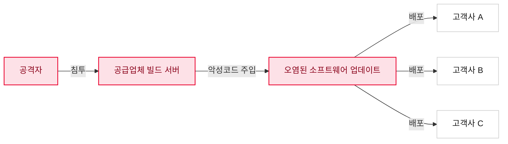

{}
이 페이지는 공급망 보안의 배경을 설명하는 학습 자료입니다. SBOM 생성과 제출 방법을 찾으신다면 [공급사 가이드](/guide/supply-chain/for-suppliers/)로 바로 이동하세요.
{}

## 1. 소프트웨어 공급망 공격이란?

소프트웨어 공급망 공격(Software Supply Chain Attack)은 공격자가 소프트웨어 개발사나 공급업체의 시스템, 또는 개발 과정에 침투하여 악성 코드를 심거나 취약점을 악용하는 사이버 공격 기법입니다.

전통적인 공격이 최종 사용자를 직접 겨냥했다면, 공급망 공격은 신뢰받는 소프트웨어 업데이트나 개발 도구를 오염시켜 이를 사용하는 수많은 하류(Downstream) 기업과 사용자들을 동시에 감염시킵니다.

```mermaid
graph LR
    A[공격자] -->|침투| B[공급업체 빌드 서버]
    B -->|악성코드 주입| C[오염된 소프트웨어 업데이트]
    C -->|배포| D[고객사 A]
    C -->|배포| E[고객사 B]
    C -->|배포| F[고객사 C]

    classDef danger fill:#FDE1E7,stroke:#EA002C,color:#8A0019,stroke-width:1.5px
    classDef victim fill:#ffffff,stroke:#c8c8c8,color:#171717,stroke-width:1px
    class A,B,C danger
    class D,E,F victim
```

## 2. 주요 공격 사례

- SolarWinds 사태 (2020): 빌드 시스템이 해킹당해 정식 서명된 업데이트에 백도어가 심어졌고, 미국 정부 기관을 포함해 전 세계 18,000여 개 조직이 피해를 입었습니다. 신뢰하는 벤더의 소프트웨어조차 안전하지 않을 수 있음을 보여 주었습니다.
- Log4j 취약점 (2021): 널리 쓰이는 로깅 라이브러리에서 원격 코드 실행 취약점이 발견되어 전 세계 수억 대의 서버가 노출되었습니다. 우리 시스템이 어떤 오픈소스를 쓰는지 파악하는 수단, 즉 SBOM의 필요성을 각인시킨 계기입니다.

## 3. 왜 공급망 보안인가?

현대 애플리케이션 코드의 70~90%는 오픈소스 컴포넌트로 구성됩니다. 공통 컴포넌트 하나가 오염되면 피해가 전 세계로 확산되고, 빌드 단계에서 오염된 코드는 방화벽이나 백신 같은 전통적인 보안 검사로 잡기 어렵습니다. 이런 위험을 관리하기 위해 SK텔레콤은 SBOM 도입과 공급망 보안 정책을 시행하고 있습니다.

## 관련 문서

- [글로벌 규제 동향](regulations/): 미국 EO 14028, EU CRA 등 주요 규제 현황
- [SK텔레콤 공급망 보안 정책](policy/): SK텔레콤의 구체적인 요구사항
- [공급사 가이드](/guide/supply-chain/for-suppliers/): 공급사를 위한 SBOM 생성 및 제출 안내
