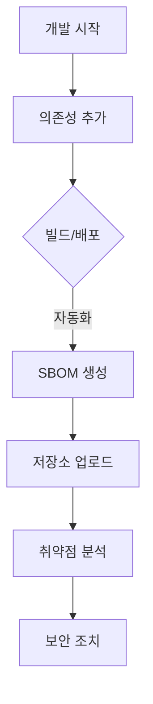

## 개요

이 섹션은 기업 구성원을 위한 SBOM(Software Bill of Materials) 실무 가이드입니다. 단순히 정책을 준수하는 것을 넘어, SBOM을 활용하여 프로젝트의 보안성을 높이고 의존성 관리의 효율성을 높이는 방법을 다룹니다.

## 가이드 구성

본 가이드는 SBOM의 도입부터 운영까지 단계별로 구성되어 있습니다.

1. [개념 및 필요성](what-is-sbom/): SBOM이 무엇이며, 왜 지금 우리에게 필요한지 근본적인 이유를 설명합니다.
2. [표준 비교 (SPDX vs CycloneDX)](standards/): 업계 표준 포맷의 차이점을 이해하고, 프로젝트 성격에 맞는 포맷을 선택할 수 있습니다.
3. 프로젝트 SBOM 생성: 개발 중인 프로젝트에서 직접 SBOM을 추출하는 실무적인 방법을 안내합니다.
4. CI/CD 통합: Jenkins, GitHub Actions 등 CI/CD 파이프라인에 SBOM 생성을 자동화하는 방법을 다룹니다.
5. SBOM 관리: 생성된 SBOM을 중앙 저장소에 저장하고 버전별로 관리하는 전략을 소개합니다.

## SBOM 생성

상세한 SBOM 생성 방법과 기술적 가이드는 다음 문서를 참고하시기 바랍니다.

- [공급사 가이드 (For Suppliers)](../../for-suppliers/)
- [SBOM 생성 방법](../../for-suppliers/sbom-generation/)