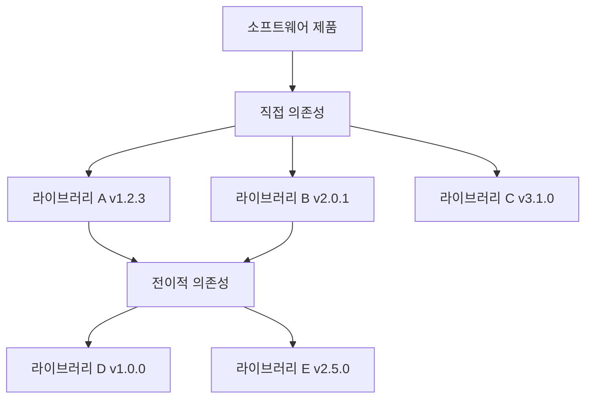

## SBOM의 정의

SBOM (Software Bill of Materials)은 소프트웨어를 구성하는 모든 컴포넌트, 라이브러리, 모듈 등의 목록과 그들 간의 의존성 관계를 기술한 정형화된 명세서입니다. 제조업에서 제품의 부품 목록을 관리하는 BOM(Bill of Materials) 개념을 소프트웨어 공학에 적용한 것입니다.



## SBOM의 주요 구성 요소

### 컴포넌트 정보

각 소프트웨어 컴포넌트에 대한 기본 정보를 포함합니다.

- 이름(Name): 컴포넌트의 공식 명칭
- 버전(Version): 정확한 버전 번호
- 공급자(Supplier): 컴포넌트를 제공한 조직 또는 개인
- 라이선스(License): 적용되는 오픈소스 라이선스

### 고유 식별자

컴포넌트를 명확히 식별하기 위한 표준화된 식별자를 사용합니다.

Package URL (purl)

가장 일반적으로 사용되는 식별자 형식입니다.

```
pkg:maven/org.springframework/spring-core@5.3.20
pkg:npm/express@4.18.2
pkg:pypi/django@4.1.0
```

CPE (Common Platform Enumeration)

보안 취약점 데이터베이스와 연동하기 위해 사용됩니다.

```
cpe:2.3:a:apache:log4j:2.14.1:*:*:*:*:*:*:*
```

### 의존성 관계

컴포넌트 간의 의존성 관계를 명시합니다.

- 직접 의존성(Direct Dependencies): 프로젝트가 직접 사용하는 라이브러리
- 전이적 의존성(Transitive Dependencies): 직접 의존성이 다시 의존하는 라이브러리

### 메타데이터

SBOM 자체에 대한 정보를 포함합니다.

- 생성 도구: SBOM을 생성한 도구의 이름과 버전
- 생성 시각: SBOM이 생성된 날짜와 시간
- 생성자: SBOM을 생성한 조직 또는 개인

## 왜 필요한가?

SBOM은 단순한 문서가 아니라 소프트웨어 투명성을 위한 핵심 데이터입니다.

### 1. 보안 취약점의 신속한 식별
새로운 취약점(예: Log4j 사태)이 발표되었을 때, 우리 서비스 중 어디에 해당 라이브러리가 쓰이고 있는지 즉시 파악할 수 있습니다. SBOM이 없다면 모든 서버와 코드를 일일이 전수 조사해야 하며, 대응 골든타임을 놓치게 됩니다.

### 2. 라이선스 리스크 관리
오픈소스 라이선스 위반은 법적 분쟁으로 이어질 수 있습니다. SBOM을 통해 프로젝트에 포함된 모든 라이선스를 식별하고, 호환되지 않는 라이선스(예: GPL과 상용 코드의 결합) 사용을 사전에 차단할 수 있습니다.

### 3. 소프트웨어 품질 및 노후화 관리
오래되고 지원이 중단된(EOL, End-of-Life) 컴포넌트를 식별하여 기술 부채를 관리하고 소프트웨어의 건전성을 유지할 수 있습니다.

### 4. 규제 준수

미국 연방 정부를 비롯한 다양한 조직에서 SBOM 제출을 의무화하고 있습니다.

- 미국 행정명령 14028 (연방 정부 공급사)
- EU Cyber Resilience Act
- 의료기기 FDA 승인

## 관련 문서

- [SBOM 표준 비교 (SPDX vs CycloneDX)](../standards/)
- [공급사 가이드](/guide/supply-chain/for-suppliers/): SBOM 생성 및 제출 방법

## 참고 자료

- [NTIA SBOM Minimum Elements](https://www.ntia.gov/files/ntia/publications/sbom_minimum_elements_report.pdf)
- [CISA SBOM Sharing Lifecycle](https://www.cisa.gov/sbom)
- [Linux Foundation: SBOM Guide](https://www.linuxfoundation.org/tools/the-state-of-software-bill-of-materials-sbom-and-cybersecurity-readiness/)
