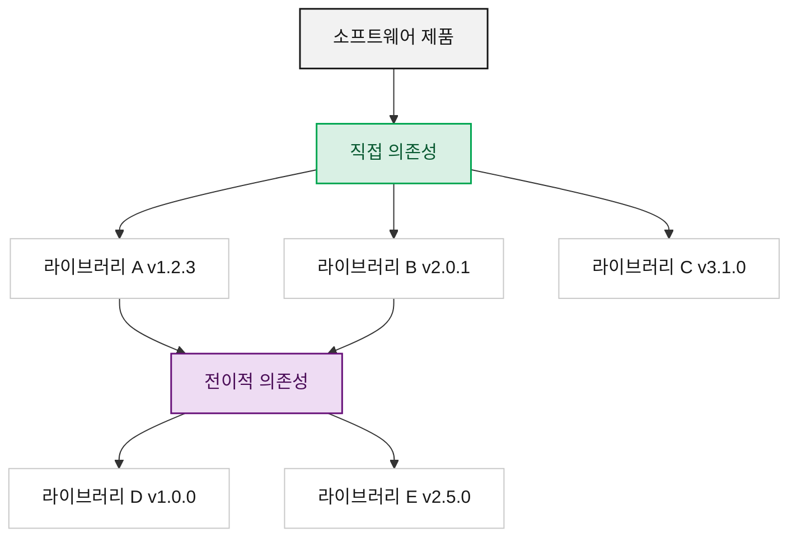

## SBOM의 정의

SBOM (Software Bill of Materials)은 소프트웨어를 구성하는 모든 컴포넌트, 라이브러리, 모듈 등의 목록과 그들 간의 의존성 관계를 기술한 정형화된 명세서입니다. 제조업에서 제품의 부품 목록을 관리하는 BOM(Bill of Materials) 개념을 소프트웨어 공학에 적용한 것입니다.

```mermaid
graph TD
    A[소프트웨어 제품] --> B[직접 의존성]
    B --> C[라이브러리 A v1.2.3]
    B --> D[라이브러리 B v2.0.1]
    B --> E[라이브러리 C v3.1.0]
    C --> F[전이적 의존성]
    F --> G[라이브러리 D v1.0.0]
    F --> H[라이브러리 E v2.5.0]
    D --> F

    classDef root fill:#F2F2F2,stroke:#171717,color:#171717,stroke-width:1.5px
    classDef direct fill:#D9F0E4,stroke:#00A651,color:#0A5A32,stroke-width:1.5px
    classDef trans fill:#EEDCF3,stroke:#68127A,color:#4A0D57,stroke-width:1.5px
    classDef lib fill:#ffffff,stroke:#c8c8c8,color:#171717,stroke-width:1px

    class A root
    class B direct
    class F trans
    class C,D,E,G,H lib
```

## SBOM의 주요 구성 요소

SBOM 문서에는 다음 정보가 담깁니다.

- 컴포넌트 정보: 이름, 버전, 공급자, 라이선스
- 고유 식별자: 컴포넌트를 명확히 식별하는 표준 식별자. Package URL(purl)이 가장 널리 쓰입니다. (예: `pkg:maven/org.springframework/spring-core@5.3.20`)
- 의존성 관계: 직접 의존성(프로젝트가 직접 사용)과 전이적 의존성(직접 의존성이 다시 의존)
- 메타데이터: 생성 도구, 생성 시각, 생성자

SK텔레콤에 제출할 때 각 항목의 필수 여부와 형식은 [제출 요구사항](/guide/supply-chain/for-suppliers/requirements/)이 규정합니다.

## 왜 필요한가?

SBOM은 단순한 문서가 아니라 소프트웨어 투명성을 위한 핵심 데이터입니다.

### 1. 보안 취약점의 신속한 식별
새로운 취약점(예: Log4j 사태)이 발표되었을 때, 우리 서비스 중 어디에 해당 라이브러리가 쓰이고 있는지 즉시 파악할 수 있습니다. SBOM이 없다면 모든 서버와 코드를 일일이 전수 조사해야 하며, 대응 골든타임을 놓치게 됩니다.

### 2. 라이선스 리스크 관리
오픈소스 라이선스 위반은 법적 분쟁으로 이어질 수 있습니다. SBOM을 통해 프로젝트에 포함된 모든 라이선스를 식별하고, 호환되지 않는 라이선스(예: GPL과 상용 코드의 결합) 사용을 사전에 차단할 수 있습니다.

### 3. 소프트웨어 품질 및 노후화 관리
오래되고 지원이 중단된(EOL, End-of-Life) 컴포넌트를 식별하여 기술 부채를 관리하고 소프트웨어의 건전성을 유지할 수 있습니다.

이런 배경에서 미국·유럽 등의 규제도 SBOM 제출을 의무화하는 방향으로 강화되고 있습니다. 자세한 내용은 [규제 동향](/guide/supply-chain/overview/regulations/)을 참고하세요.

## 관련 문서

- [SBOM 표준 비교 (SPDX vs CycloneDX)](../standards/)
- [공급사 가이드](/guide/supply-chain/for-suppliers/): SBOM 생성 및 제출 방법

## 참고 자료

- [NTIA SBOM Minimum Elements](https://www.ntia.gov/files/ntia/publications/sbom_minimum_elements_report.pdf)
- [CISA SBOM Sharing Lifecycle](https://www.cisa.gov/sbom)
- [Linux Foundation: SBOM Guide](https://www.linuxfoundation.org/tools/the-state-of-software-bill-of-materials-sbom-and-cybersecurity-readiness/)
