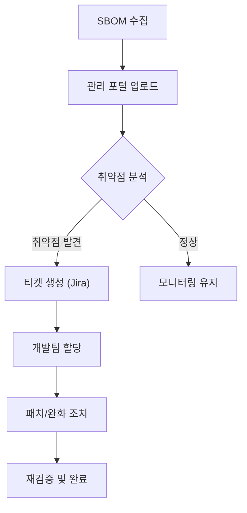

## 개요

SBOM 생성은 끝이 아니라 시작입니다. 생성된 SBOM 데이터를 활용하여 우리 소프트웨어에 숨어있는 알려진 취약점(Known Vulnerabilities)을 찾아내고, 신속하게 조치하는 것이 공급망 보안의 핵심 목표입니다.

본 가이드는 SK텔레콤의 취약점 관리 프로세스와 도구 활용법을 다룹니다.

## 가이드 구성

1. [취약점 관리 프로세스](overview/): 취약점 식별부터 조치까지의 전체 프로세스 흐름을 이해합니다.
2. [지속적 모니터링](continuous-monitoring/): 일회성 점검이 아닌, 매일 새로운 위협을 감지하는 체계를 구축합니다.
3. [사고 대응 시나리오](incident-response/): Log4j와 같은 긴급 보안 사고 발생 시 대응 절차를 학습합니다.
<!-- 3. [Dependency Track 활용](dependency-track/): SK텔레콤 표준 SBOM 분석 플랫폼인 Dependency Track 사용법을 익힙니다. -->

