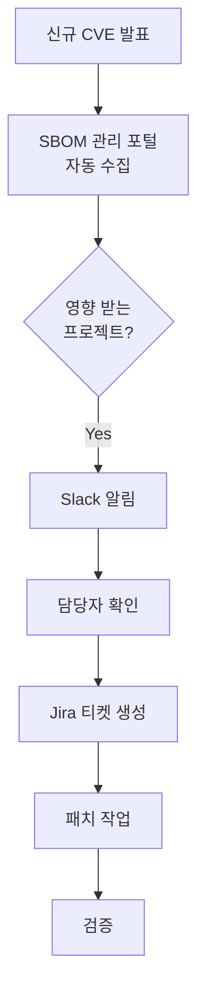

## 왜 지속적 모니터링인가?

어제 안전했던 소프트웨어가 오늘은 위험할 수 있습니다. (Zero-day vulnerability)
소프트웨어 코드는 변하지 않았더라도, 그 코드가 사용하는 라이브러리에서 새로운 취약점이 발견될 수 있기 때문입니다. 따라서 빌드 시점에만 검사하는 것으로는 불충분합니다.

## 자동화된 모니터링 체계

SK텔레콤은 SBOM 관리 포털을 통해 중앙 집중화된 모니터링 환경을 제공합니다.

### 1. 일일 동기화 (Daily Sync)
SBOM 관리 포털은 NVD, OSS Index 등 글로벌 취약점 데이터베이스와 매일 동기화됩니다.

### 2. 실시간 영향도 분석
새로운 CVE가 데이터베이스에 등록되는 즉시, 저장된 모든 프로젝트의 SBOM과 대조 분석을 수행합니다. 우리 프로젝트가 해당 취약점의 영향을 받는지 1시간 이내에 파악할 수 있습니다.

### 3. 알림 (Alerting)
위험도(Critical, High)가 높은 새로운 취약점이 탐지되면, 담당자에게 즉시 알림이 발송됩니다.

- Slack/Teams 연동: 팀 채널로 실시간 알림 전송
- 이메일: 보안 담당자 및 프로젝트 PL에게 리포트 발송
- Jira 티켓 생성: 자동으로 이슈를 생성하여 조치 프로세스 시작

## 모니터링 대상

- 운영 중인 서비스 (Production): 현재 고객에게 서비스되고 있는 버전
- 개발 중인 프로젝트 (Development): 릴리스 예정인 차기 버전
- 레거시 시스템: 더 이상 개발되지 않지만 운영 중인 시스템 (관리가 소홀하기 쉬움)

## 자동화 워크플로우

