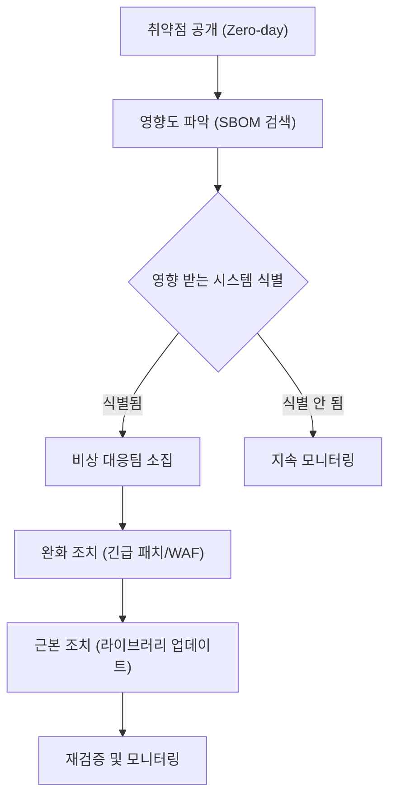

## 긴급 대응 프로세스

초고위험(Critical) 취약점이 공개되었을 때, 신속한 대응이 기업의 생존을 결정합니다.

## 시나리오: Log4j 사태 재연

가상의 상황을 통해 대응 절차를 익혀봅시다.

### 상황 발생 (D-Day 09:00)
- 뉴스: "Apache Log4j 2.x 버전에서 치명적인 원격 코드 실행 취약점(Log4Shell) 발견"
- 보안팀: 즉시 SBOM 관리 포털 검색 시작

### 1. 영향도 파악 (09:10)
SBOM 관리 포털의 Global Search 기능을 활용하여 전사적으로 `log4j-core` 컴포넌트를 검색합니다.

- 검색어: `pkg:maven/org.apache.logging.log4j/log4j-core`
- 결과: 총 150개 프로젝트 중 12개 프로젝트에서 취약한 버전(2.0-beta9 ~ 2.14.1) 사용 중임이 식별됨.

### 2. 비상 전파 (09:30)
식별된 12개 프로젝트의 담당자에게 긴급 알림(Slack/SMS) 발송.
> "귀하의 프로젝트(OOO시스템)가 Log4j 취약점(CVE-2021-44228)에 노출되었습니다. 즉시 조치 바랍니다."

### 3. 긴급 완화 조치 (10:00)
라이브러리 업데이트에는 시간이 걸리므로, 즉시 적용 가능한 완화 조치를 먼저 수행합니다.
- 조치: JVM 시작 옵션에 `-Dlog4j2.formatMsgNoLookups=true` 추가 후 재기동.

### 4. 근본 조치 (D+1일)
개발팀은 안전한 버전(`2.17.1` 이상)으로 의존성을 업데이트하고 테스트를 거쳐 정식 배포를 진행합니다.

### 5. 검증 및 종료 (D+3일)
모든 대상 시스템의 SBOM이 갱신되었으며, SBOM 관리 포털에서 해당 취약점이 더 이상 탐지되지 않음을 확인하고 비상 상황을 종료합니다.
