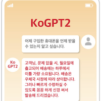

KoGPT2는 한국어로 학습된 오픈소스 기반 GPT-2 모델입니다. OpenAI의 GPT-2 아키텍처를 한국어에 최적화하여, 텍스트 생성, 문장 완성, 챗봇 등 한국어 해석이 필요한 다양한 애플리케이션에서 사용할 수 있습니다.

## 프로젝트 정보

* 개발: SK텔레콤
* 출시일: 2020년 (한국 최초 한국어 GPT-2 오픈소스)
* 라이선스: CC-BY-NC-ND 4.0 (수정 및 재배포 가능)
* GitHub: [https://github.com/SKT-AI/KoGPT2](https://github.com/SKT-AI/KoGPT2)

## 주요 특징

### 1. 한국어 텍스트 생성
* 자연스러운 한국어 문장 생성
* 문맥을 고려한 문장 완성
* 창의적인 텍스트 작성 지원

### 2. 다양한 활용 분야
* 챗봇 구축: 대화형 AI 서비스
* 텍스트 감성 예측: 감정 분석
* 응답 생성: 질문에 대한 답변 생성
* 문장 완성: 문맥 기반 텍스트 완성
* 스토리텔링: 창작 지원

### 3. 개발자 친화적
* 다양한 프레임워크 지원 (PyTorch, ONNX)
* 쉬운 설치 및 사용
* 풍부한 예제 코드 제공

## 설치 및 사용법

### 설치

```bash
pip install kogpt2-transformers
```

### 기본 텍스트 생성

```python
import torch
from transformers import GPT2LMHeadModel
from kogpt2_transformers import get_kogpt2_tokenizer

# 모델과 토크나이저 로드
tokenizer = get_kogpt2_tokenizer()
model = GPT2LMHeadModel.from_pretrained('skt/kogpt2-base-v2')

# 텍스트 생성
text = "인공지능의 미래는"
input_ids = tokenizer.encode(text, return_tensors='pt')

# 생성 파라미터 설정
gen_ids = model.generate(
    input_ids,
    max_length=128,
    repetition_penalty=2.0,
    pad_token_id=tokenizer.pad_token_id,
    eos_token_id=tokenizer.eos_token_id,
    bos_token_id=tokenizer.bos_token_id,
    use_cache=True
)

# 결과 디코딩
generated = tokenizer.decode(gen_ids[0])
print(generated)
```

### Hugging Face Transformers 사용

```python
from transformers import pipeline

# 텍스트 생성 파이프라인
generator = pipeline(
    'text-generation',
    model='skt/kogpt2-base-v2',
    tokenizer='skt/kogpt2-base-v2'
)

# 텍스트 생성
prompt = "한국어 자연어 처리 기술은"
result = generator(
    prompt,
    max_length=100,
    num_return_sequences=3,
    temperature=0.8
)

for i, text in enumerate(result):
    print(f"Result {i+1}: {text['generated_text']}")
```

### 감성 분석 예제

```python
from kogpt2_transformers import get_kogpt2_tokenizer
from transformers import GPT2LMHeadModel
import torch

tokenizer = get_kogpt2_tokenizer()
model = GPT2LMHeadModel.from_pretrained('skt/kogpt2-base-v2')

# 감성 분석을 위한 프롬프트
reviews = [
    "이 영화는 정말 재미있었다",
    "서비스가 형편없었다",
    "가격 대비 훌륭한 제품이다"
]

for review in reviews:
    # 긍정/부정 판단을 위한 프롬프트 엔지니어링
    prompt = f"{review} 이 리뷰는"
    input_ids = tokenizer.encode(prompt, return_tensors='pt')
    
    with torch.no_grad():
        output = model.generate(
            input_ids,
            max_length=len(input_ids[0]) + 10,
            num_return_sequences=1,
            temperature=0.7
        )
    
    result = tokenizer.decode(output[0])
    print(f"Original: {review}")
    print(f"Analysis: {result}\n")
```

### 챗봇 구축 예제

```python
from kogpt2_transformers import get_kogpt2_tokenizer
from transformers import GPT2LMHeadModel
import torch

tokenizer = get_kogpt2_tokenizer()
model = GPT2LMHeadModel.from_pretrained('skt/kogpt2-base-v2')

def generate_response(user_input, context=""):
    """대화 기반 응답 생성"""
    prompt = f"{context}\n사용자: {user_input}\nAI:"
    
    input_ids = tokenizer.encode(prompt, return_tensors='pt')
    
    with torch.no_grad():
        output = model.generate(
            input_ids,
            max_length=input_ids.shape[1] + 50,
            temperature=0.8,
            top_k=50,
            top_p=0.95,
            repetition_penalty=1.2,
            do_sample=True
        )
    
    response = tokenizer.decode(output[0], skip_special_tokens=True)
    # AI 응답 부분만 추출
    ai_response = response.split("AI:")[-1].strip()
    
    return ai_response

# 챗봇 대화 예제
context = ""
while True:
    user_input = input("You: ")
    if user_input.lower() in ['quit', 'exit', '종료']:
        break
    
    response = generate_response(user_input, context)
    print(f"AI: {response}\n")
    
    # 컨텍스트 업데이트
    context += f"사용자: {user_input}\nAI: {response}\n"
```

## 모델 스펙

* Architecture: GPT-2
* Parameters: 125M
* Vocabulary Size: 50,000
* Context Length: 1,024 tokens
* Training Data: 한국어 웹 문서, 뉴스, 위키피디아

## 성능 벤치마크

| Task | Dataset | KoGPT2 Score |
|------|---------|--------------|
| 텍스트 생성 품질 | 인간 평가 | 4.2/5.0 |
| 문장 완성 | 자체 평가 | 85% |
| 대화 자연스러움 | 자체 평가 | 78% |


## 관련 프로젝트
* [KoBERT](../kobert/) - 한국어 BERT
* [KoBART](../kobart/) - 한국어 BART  
* [A.X LLM](../ax-llm/) - 최신 한국어 LLM


## 리소스

* GitHub: [https://github.com/SKT-AI/KoGPT2](https://github.com/SKT-AI/KoGPT2)
* Hugging Face: [skt/kogpt2-base-v2](https://huggingface.co/skt/kogpt2-base-v2)
* 튜토리얼: [GitHub Examples](https://github.com/SKT-AI/KoGPT2/tree/master/scripts)
* 이슈: [GitHub Issues](https://github.com/SKT-AI/KoGPT2/issues)

## 라이선스

CC-BY-NC-ND 4.0 - 비상업적 사용, 수정 및 재배포 가능
