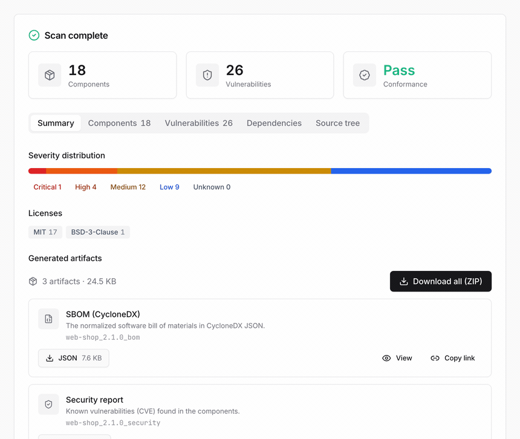

BomLens는 소프트웨어의 구성 요소를 분석해 CycloneDX 1.6 형식의 SBOM(소프트웨어 구성 명세)을 자동으로 만들어 주는 공급망 보안 도구입니다. 소스 코드나 컨테이너 이미지, 바이너리를 검사해 SBOM과 오픈소스 고지문, 보안 리포트를 생성하고, 거꾸로 공급사에게 받은 SBOM이나 펌웨어를 분석해 오픈소스 리스크 리포트도 만들어 줍니다. SK텔레콤이 공급망 보안을 위해 개발해 오픈소스로 공개했습니다.



## 프로젝트 정보

* 개발: SK텔레콤
* 라이선스: Apache License 2.0
* GitHub: [https://github.com/sktelecom/bomlens](https://github.com/sktelecom/bomlens)
* 컨테이너 이미지: `ghcr.io/sktelecom/sbom-generator`

## 주요 특징

### 두 가지 작업을 하나의 도구로

* 생성: 소스 코드나 컨테이너 이미지, 바이너리를 검사해 CycloneDX SBOM과 오픈소스 고지문, 보안 리포트를 생성
* 리스크 분석: 공급사에게 받은 SBOM이나 펌웨어를 분석해 라이선스와 알려진 취약점을 정리한 오픈소스 리스크 리포트를 생성
* 모든 검사는 기본적으로 리스크 리포트를 함께 산출

### 폭넓은 입력과 언어 지원

* 입력: 소스 폴더, GitHub 주소, ZIP 압축 파일, Docker 이미지, 바이너리와 RootFS, 기존 SBOM, 펌웨어
* 언어: Java, Python, Node.js, Ruby, PHP, Rust, Go, .NET, C/C++(Conan, vcpkg)

### 여러 사용 형태

* 웹 UI: 브라우저에서 검사하고 실시간 로그를 확인하며 결과를 내려받기
* 명령줄 도구(CLI): CI/CD 파이프라인에 연동
* 데스크톱 앱: Windows와 macOS에서 더블 클릭으로 실행 (콘솔 창 없이 Docker 확인부터 UI 실행까지 자동)

### 산출물

* `bom.json`: CycloneDX SBOM
* `NOTICE.txt`, `NOTICE.html`: 오픈소스 고지문
* `risk-report.md`, `risk-report.html`: 오픈소스 리스크 리포트
* `security.json`, `security.md`, `security.html`: 보안 취약점 리포트

## 설치 및 사용법

Docker 엔진(20.10 이상)이 필요합니다. Windows에서는 무료인 [Rancher Desktop](https://rancherdesktop.io/)을 권장합니다.

### 준비

```bash
git clone https://github.com/sktelecom/bomlens.git
cd bomlens
docker pull ghcr.io/sktelecom/sbom-generator:latest
```

### 웹 UI

```bash
# 결과가 저장될 폴더에서 실행하면 http://localhost:8080 이 열립니다
/path/to/bomlens/scripts/scan-sbom.sh --ui

# Windows에서는 scripts\sbom-ui.bat 더블 클릭
```

브라우저에서 프로젝트 이름과 버전을 입력하고, 검사 대상(현재 폴더, GitHub 주소, ZIP, SBOM, 펌웨어 업로드, Docker 이미지)을 고른 뒤 검사를 실행하면 결과를 확인하고 내려받을 수 있습니다.

### CLI

```bash
# 현재 프로젝트의 모든 산출물 생성
./scripts/scan-sbom.sh --project MyApp --version 1.0.0 --all --generate-only

# 다른 입력 예시 (GitHub 주소, 소스 압축 파일, Docker 이미지, 펌웨어)
./scripts/scan-sbom.sh --git https://github.com/org/repo --project MyApp --version 1.0.0 --all --generate-only
./scripts/scan-sbom.sh --target ./src.zip --project MyApp --version 1.0.0 --all --generate-only
./scripts/scan-sbom.sh --target nginx:latest --project MyApp --version 1.0.0 --all --generate-only
./scripts/scan-sbom.sh --target dev.bin --firmware --project MyApp --version 1.0.0 --all --generate-only
```

## 라이선스

Apache License 2.0 - 상업적 사용 가능

## 리소스

* GitHub: [https://github.com/sktelecom/bomlens](https://github.com/sktelecom/bomlens)
* 시작하기: [getting-started.md](https://github.com/sktelecom/bomlens/blob/main/docs/getting-started.md)
* 라이선스 담당자용 빠른 시작: [notice-quickstart.md](https://github.com/sktelecom/bomlens/blob/main/docs/notice-quickstart.md)
* 데스크톱 앱 다운로드: [Releases](https://github.com/sktelecom/bomlens/releases)
* 이슈: [GitHub Issues](https://github.com/sktelecom/bomlens/issues)
