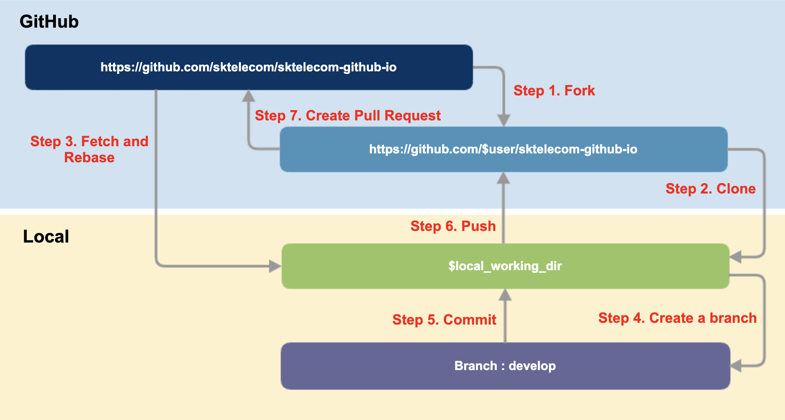

# Git Workflow

웹사이트 개발을 위한 Git Workflow를 설명합니다. 



## Step 1. Fork

1. https://github.com/sktelecom/sktelecom.github.io 에 방문하여,
2. 화면 우상단의 Fork 버튼을 눌러 fork합니다.

## Step 2. Clone

Fork한 repository를 Local working directory로 Clone하고, Remote에 Upstream repository를 추가합니다.

```
$ git clone https://github.com/[user]/sktelecom.github.io.git
 
$ cd sktelecom.github.io
$ git remote add upstream https://github.com/sktelecom/sktelecom.github.io.git
$ git remote -v                                                              
origin  https://github.com/[user]/sktelecom.github.io.git (fetch)
origin  https://github.com/[user]/sktelecom.github.io.git (push)
upstream    https://github.com/sktelecom/sktelecom.github.io.git (fetch)
upstream    https://github.com/sktelecom/sktelecom.github.io.git (push)
```

## Step 3. Fetch and Rebase

(Clone후 시간이 지난 시점이라면) upstream을 fetch했을때 변경 사항이 있을 경우 경우 rebase하여 master branch를 최신 상태로 유지합니다.

```
$ git fetch upstream
$ git checkout master
$ git rebase upstream/master
```

## Step 4. 개발용 Branch 생성

개발용 Branch를 생성합니다. 

```
$ git checkout -b develop
```

## Step 5. Commit 

수정 사항을 작업 후 Commit 합니다. commit message는 가능한 자세히 작성하세요.

```
$ git add .
$ git commit
```

## Step 6. Push

생성한 commit을 origin의 develop branch에 push합니다. 

```
$ git push -f origin develop
```

## Step 7. Create a Pull Request

GitHub 사이트로 가서 Pull Request를 생성합니다. 이때 Upstream repository의 develop branch로 Create Pull Request하여 수정사항을 제출합니다. 
